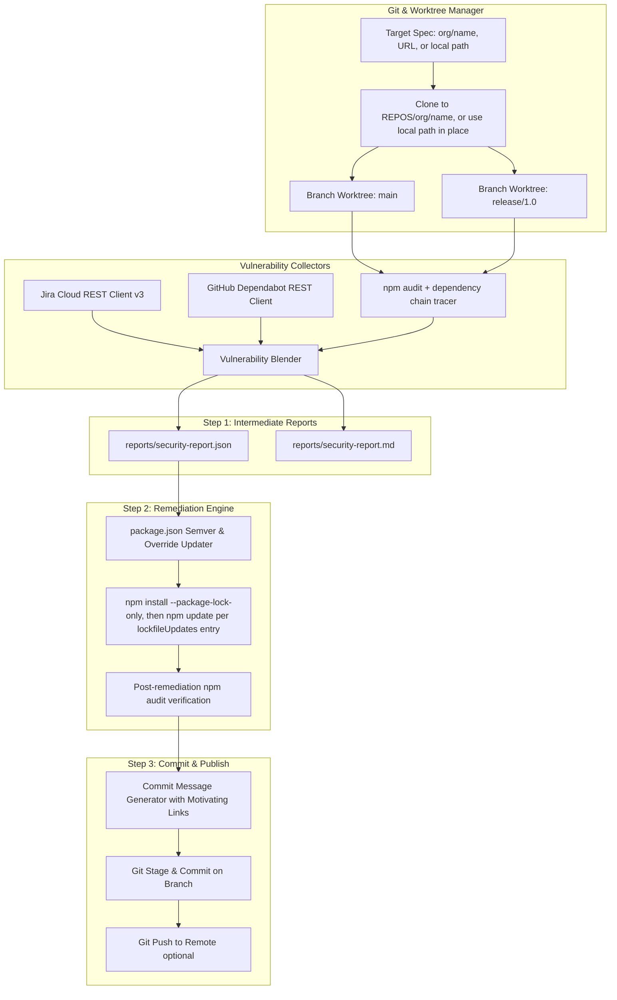

# Security Vulnerability Blender & Automated Remediation Engine (`security-report`)

## 1. Executive Summary & Design Rationale

Managing security vulnerabilities across large Node.js / npm codebases is typically fragmented:
- **npm audit** detects package-level vulnerabilities and identifies affected sub-graphs, but is branch-local and lacks business context.
- **Jira CVE tickets** track security compliance, CVE identifiers, SLAs, and security team workflows, but lack automated code-level remediation links.
- **GitHub Dependabot** flags alert numbers and repository security advisories, but automated PRs frequently create merge conflicts across multiple release branches.

This project unifies all three sources across multiple Git branches in a single repository and provides a 3-step automated workflow:
1. **Aggregate & Analyze (Step 1)**: Ingest `npm audit` across branches (isolated via Git worktrees), blend with Jira CVE tickets and GitHub Dependabot alerts, trace direct vs. indirect ancestor chains, and generate a normalized intermediate report (`JSON` and `Markdown`).
2. **Remediate (Step 2)**: Execute safe, deterministic dependency updates modeled after `npm-check-updates` (`package.json` updates first, followed by atomic lockfile synchronization and post-remediation audit verification).
3. **Commit & Trace (Step 3)**: Generate rich conventional Git commit messages linking CVEs, Jira tickets, Dependabot alerts, and exact ancestor chains, and commit directly to the target branches.

---

## 2. System Architecture & Data Flow



---

## 3. Directory & Component Structure

```
security-report/
├── package.json               # Node.js ESM configuration & dependencies (commander, semver)
├── README.md                  # User-facing usage, configuration, and CLI reference
├── AGENTS.md                  # System design rationale and architecture documentation
├── .gitignore                 # Excludes REPOS/, reports/, .worktrees/ and .security-report.json
├── bin/
│   └── sec-remediate.js       # CLI executable entrypoint (chmod +x)
├── src/
│   ├── index.js               # Core library orchestrator (scanRepository, remediateRepository)
│   ├── cli.js                 # Commander CLI definitions (scan/report, fix/remediate)
│   ├── config.js              # Configuration loader (env vars, config files, CLI options)
│   ├── core/
│   │   ├── git-manager.js     # Clone/fetch, credential-free auth, worktree lifecycle & branch commits
│   │   ├── dependency-graph.js# Ancestor chain resolution (direct vs. transitive hierarchy)
│   │   ├── blender.js         # Tri-source blending (npm audit + Jira CVEs + Dependabot alerts)
│   │   ├── remediator.js      # package.json and package-lock.json update & verification engine
│   │   └── commit-generator.js# Formats commit messages with CVE, Jira, Dependabot & chain metadata
│   ├── collectors/
│   │   ├── npm-audit.js       # npm audit --json, findings extraction & remediation strategy builder
│   │   ├── jira.js            # Pure JS deterministic Atlassian Jira Cloud REST client
│   │   ├── dependabot.js      # Pure JS GitHub Dependabot Alerts REST client
│   │   └── advisories.js      # GHSA/CVE resolution via GitHub Advisory API with OSV fallback
│   └── report/
│       ├── json-reporter.js   # Intermediate JSON report generator
│       └── markdown-reporter.js # Human-readable Markdown summary generator
└── test/
    ├── git-manager.test.js    # Repo spec parsing, credential redaction, worktree & branch-commit behaviour
    ├── audit-collector.test.js# Audit parsing, chain tracing, remediation strategies & reporting
    ├── remediator.test.js     # package.json modification, change de-duplication and overrides handling
    ├── external-collectors.test.js # Jira/Dependabot parsing, blending and configuration loading
    └── integration.test.js    # End-to-end multi-branch scan, report, and commit creation
```

---

## 4. Key Design Decisions

### A. Repository Isolation, Remote Synchronization & Multi-Branch Worktrees
- **Problem**: Switching branches in a single working copy invalidates `node_modules`, risks uncommitted changes, and prevents parallel branch analysis. Furthermore, stale local caches might not reflect new commits pushed to the remote repository.
- **Solution**:
  1. **Remote Fetch on Each Run**: `ensureRepo` executes `git fetch --all --prune --tags` to guarantee all remote branch pointers (`origin/*`) are up to date.
  2. **Remote HEAD Reset**: `createWorktree` creates worktrees with `git worktree add -B <branch> <worktreeDir> origin/<branch>`, automatically resetting and fast-forwarding the local branch to the latest remote HEAD on every report run.
  3. **Base Detachment & Branch Commits**: Base repositories — including repositories targeted by a local path — are detached (`git checkout --detach`, logged when it happens) so all branch names remain available for worktrees and no commit can land on a detached worktree HEAD. Worktree commits therefore advance `refs/heads/<branch>` directly; when they cannot (branch held by another worktree), `stageAndCommit` performs a compare-and-swap `git update-ref refs/heads/<branch> <new> <old>` or aborts with the holding worktree's path rather than stranding the commit.
  4. **Worktree Retention**: `withWorktree` removes the worktree only after the callback succeeds. `sec-remediate fix` without `--commit` keeps it and prints its path, because it is the only copy of the applied fix; a failed callback keeps it too.

### B. Direct vs. Indirect Ancestor Chain Resolution & 5-Tier Remediation Strategy
- **Problem**: `npm audit` reports hoisted paths (e.g. `node_modules/@xmldom/xmldom`), obscuring the logical parent (e.g. `msw -> @mswjs/interceptors -> @xmldom/xmldom`).
- **Solution**: `src/core/dependency-graph.js` combines `npm ls --all --json` traversal and reverse graph backtracking over `package-lock.json` packages to reconstruct the complete logical ancestry tree down to root `package.json` dependencies. Strategy selection itself lives in `buildRemediationSuggestion` (`src/collectors/npm-audit.js`), with per-package consolidation in `src/core/blender.js`.
- **5-Tier Remediation Strategy** (first match wins):
  1. **`bump-direct`**: Directly updates `package.json` if the package is declared in `dependencies`/`devDependencies`.
  2. **`bump-direct-and-lockfile`**: Same as above when the package is *also* pulled in transitively (`Direct & Indirect`); the package.json bump is paired with a lockfile re-resolution for the remaining instances. See section H.
  3. **`bump-direct-parent`**: If a direct root parent (e.g. `msw`) has an updated version available that pulls in the safe dependency, updates the direct parent in `package.json`.
  4. **`lockfile-update`**: If the parent package's declared semver range already permits the safe patched version (e.g. parent requires `>=0.7.0 <0.9.0` and `0.8.8` is safe), re-resolves the package inside the lockfile via `npm update <pkg> --package-lock-only` without adding unnecessary `package.json` overrides. `npm install <pkg>@<version>` is deliberately not used: it would also add the transitive package to the root `package.json`.
  5. **`package-override`**: Fallback applied if and only if parent ranges strictly forbid the safe version and no direct parent bump is available.

Every strategy carries `packageJsonChanges` (file-scoped semver edits) and `lockfileUpdates` (package names to re-resolve). `remediateBranch` de-duplicates both across findings — for a package targeted by several advisories, the highest requested version wins.

### C. Deterministic JS Clients & Automatic Configuration Validation
- **Decision**: Uses native Node.js `fetch` and ESM modules for Jira and Dependabot REST communication rather than external runtime dependencies or MCP bridges.
- **Jira Integration**: Targets Jira Cloud's `/rest/api/3` endpoints only (a `POST /search/jql` fallback covers the removal of the GET form); Jira Server / Data Center `/rest/api/2` is **not** supported. Authenticates with Basic Auth (`email` + `apiToken`) or a Personal Access Token (Bearer).
- **Graceful Degradation**: If the Jira collector is enabled but its configuration is incomplete (missing `baseUrl` or `apiToken`), the tool automatically disables the Jira collector, logs an informative notice, and continues scanning with remaining enabled collectors without crashing.
- **Dependabot Integration**: Uses GitHub REST API (`/repos/{owner}/{repo}/dependabot/alerts`) with bearer token authentication.
- **Credential Handling**: `GITHUB_TOKEN` is never embedded in a clone URL. `parseRepoSpec` always produces a credential-free remote; `gitAuthEnv` passes `Authorization: Basic <base64(x-access-token:TOKEN)>` per invocation through `GIT_CONFIG_COUNT`/`GIT_CONFIG_KEY_0`/`GIT_CONFIG_VALUE_0`, so the token reaches neither `argv` (visible via `ps`) nor `.git/config`. Every `execGit` failure message is passed through `redactCredentials` before it is thrown or logged.
- **Configuration Isolation**: `loadConfig({ noConfigFile: true })` skips `.security-report.json` / `security-report.config.json` discovery entirely. Tests MUST set it — otherwise `node --test` picks up the developer's real credentials and issues authenticated Jira/GitHub requests.

### D. 3-Step Remediation Pipeline
1. **Step 1 (Intermediate Report)**: Aggregates findings and generates a single structured JSON schema + Markdown file before touching any code.
2. **Step 2 (Remediation)**:
   - Modifies `package.json` while maintaining exact original file indentation.
   - Runs `npm install --package-lock-only` to rebuild `package-lock.json` from the updated ranges, followed by one `npm update <pkg> --package-lock-only` per package listed in `remediation.lockfileUpdates`.
   - Re-runs `npm audit` in the worktree to verify remaining issues.
3. **Step 3 (Commit Message Generation)**:
   - Formats a conventional commit message with CVE identifiers, Jira ticket URLs, Dependabot alert links, dependency chains, and verification status.

---
### E. Upstream Branch to Downstream Version Translation Table
- **Problem**: Jira CVE tickets are filed against downstream product releases (e.g. `[mta-8.2]`, `[mta-8.1]`, `affectsVersions: ["MTA 8.2.0"]`), while the codebase uses upstream Git branch names (`main`, `release-0.12`, `release-0.11`, `release-0.10`).
- **Solution**: `src/config.js` and `src/core/blender.js` maintain a configurable translation table (`branchMap`) mapping upstream branches to target downstream versions.
- **Matching Rule**: When auditing `release-0.11`, the blender only correlates tickets affecting `8.2.x` / `mta-8.2` (e.g. `MTA-7680`). When auditing `release-0.10`, it correlates tickets affecting `8.1.x` / `mta-8.1` (e.g. `MTA-7679`).

### F. Unified Upstream Branch Grouping across Collectors
- **Problem**: `npm-audit` naturally evaluates branch worktrees individually, but external API collectors (`jira`, `dependabot`) return repository-wide or project-wide lists.
- **Solution**: Both `jira` and `dependabot` collectors now structure their findings into upstream branch sections before reaching the blender:
  - `security-jira-collection.json`: Groups issues into `branches: [{ branch: "release-0.11", mappedVersions: ["8.2"], tickets: [...] }]` plus an `unassigned: [...]` section.
  - `security-dependabot-collection.json`: Groups alerts into `branches: [{ branch: "main", isDefaultBranch: true, alerts: [...] }, { branch: "release-0.11", alerts: [], note: "..." }]`.
  - `security-npm-audit-collection.json`: Contains the raw branch audit results.
- **Benefit**: All debug JSONs and intermediate data structures have a consistent, branch-scoped representation, enabling inspection and deterministic blender correlation.

### G. Jira Remote Link Advisory Resolution & Optimal Safe Version Calculation
- **Problem**: Jira CVE tickets describe downstream flaws and include web links (`remotelink`) to GitHub Security Advisories, but don't natively list upstream npm package fix versions.
- **Solution**:
  1. `src/collectors/jira.js` queries `/rest/api/3/issue/{key}/remotelink` to extract attached GHSA and CVE URLs.
  2. `src/collectors/advisories.js` fetches the advisory data from GitHub Advisory API (and OSV API), resolving `vulnerableVersionRange` and `first_patched_version` (e.g. `qs` $\rightarrow$ `6.16.0`, `js-yaml` $\rightarrow$ `4.3.2`).
  3. `src/core/blender.js` calculates the **optimal target safe version** that satisfies all combined advisories for that package on the target branch.


### H. Upstream Lockfile Assessment for Jira Findings & Dual Direct/Indirect Resolution
- **Problem**: Jira tickets track downstream flaws, but the tool needs to know what is actually installed in the target branch's `package-lock.json`. Furthermore, packages like `js-yaml` may be both directly declared in `package.json` and pulled in transitively by tools like `eslint`.
- **Solution**:
  1. `src/core/dependency-graph.js` (`lookupPackageInstalledInfo`) scans the branch worktree's `package.json` and `package-lock.json` to extract all installed versions (e.g. `3.15.1, 4.3.1`) and ancestor paths.
  2. Detects dual dependency status: `dependencyType: "Direct & Indirect"`.
  3. Formulates a dual resolution plan (`bump-direct-and-lockfile`): updates the `package.json` semver constraint for the direct dependency AND lists the package in `remediation.lockfileUpdates`, so `npm update <pkg> --package-lock-only` synchronizes all transitive instances.


### I. npm Workspaces & Monorepo Direct Dependency Support
- **Problem**: In monorepos using npm workspaces (`workspaces: ["packages/*"]`), direct dependencies can be declared in nested `package.json` files (e.g. `packages/ui/package.json`) rather than only root `package.json`.
- **Solution**:
  1. `src/core/dependency-graph.js` (`findWorkspacePackageJsons`, `getDirectDependencies`) discovers all nested workspace packages.
  2. Dependency checks aggregate direct dependencies across root and all workspaces, tracking the exact declaring workspace and file path.
  3. Remediation (`updatePackageJsonFile`) updates the specific workspace `package.json` file where the dependency is declared.

## 5. Configuration & Environment Variables

Sources are merged as **CLI option > environment variable > config file** (`.security-report.json`, else `security-report.config.json`, discovered in the working directory). The four credential fields — `githubToken`, `jira.baseUrl`, `jira.email`, `jira.apiToken` — invert the last two: an explicit config-file value wins over the environment. Library callers pass `noConfigFile: true` to skip file discovery entirely.

| Variable | CLI Flag / Field | Description | Default |
| :--- | :--- | :--- | :--- |
| `SEC_REPO` | `repo` / `[repo]` | Target repository specifier (`org/repo`, URL, or local path) | `null` |
| `SEC_REPOS_DIR` | `--repos-dir` | Directory where repositories are cloned | `./REPOS` |
| `SEC_REPORTS_DIR` | `--reports-dir` | Output directory for reports | `./reports` |
| `SEC_BRANCH_MAP` | `--branch-map` | Upstream branch to downstream version translation table | Built-in MTA map |
| `GITHUB_TOKEN` | `--github-token` | GitHub API Token for Dependabot and private clones | `""` |
| `GITHUB_API_URL` | — | Base URL for GitHub API (Enterprise support) | `https://api.github.com` |
| `GIT_PROTOCOL` | `gitProtocol` (field) | Clone protocol for `org/repo` shorthand (`https` or `ssh`) | `https` |
| `JIRA_BASE_URL` | `--jira-base-url` | Atlassian Jira instance URL | `""` |
| `JIRA_EMAIL` | `--jira-email` | Jira user email (for Basic Auth) | `""` |
| `JIRA_API_TOKEN` | `--jira-api-token` | Jira API Token or PAT | `""` |
| `JIRA_PROJECT` | `--jira-project` | Jira Project Key for CVE tickets | `MTA` |
| `JIRA_JQL` | `--jira-jql` | Custom JQL query for Jira ticket retrieval | _Auto-generated_ |
| `SEC_COLLECTORS` | `--collectors` | Comma-separated active collectors (`npm-audit`, `jira`, `dependabot`) | `npm-audit,jira,dependabot` |
| `SEC_DEBUG` | `--debug` | Save raw collector outputs to `security-<name>-collection.json` | `false` |
| — | `allowOverrides` (field) / `--no-overrides` | Allow writing npm `overrides` into the root `package.json` | `true` |

---

## 6. CLI Commands Reference

```bash
# 1. Scan target branches with all collectors
sec-remediate scan --debug

# 2. Run with JUST Jira (skips npm-audit and Dependabot)
sec-remediate scan --collectors jira

# 3. Run with JUST npm-audit (offline mode, skips Jira and Dependabot)
sec-remediate scan --collectors npm-audit

# 4. Run with specific disabled collectors
sec-remediate scan --no-dependabot

# 5. Dry-run remediation: preview package.json/lockfile changes and the commit message
#    (reports are still written to --reports-dir)
sec-remediate fix --dry-run

# 6. Apply remediation and create Git commits on each branch (Step 2 & Step 3)
sec-remediate fix --commit

# 7. Apply remediation, commit, and push to remote
sec-remediate fix --commit --push

# 8. Apply remediation without committing: the branch worktree is retained for review
sec-remediate fix
```

---

## 7. Testing & Verification Strategy

The test suite runs via native `node --test` with zero external test runners and zero network access — every test that reaches `loadConfig` passes `noConfigFile: true`, so a developer's `.security-report.json` credentials are never read or transmitted. `git` and `npm` must be available on `PATH`.

- `test/git-manager.test.js`: Repo spec parsing, absence of credentials in clone URLs, `execGit` error redaction, worktree creation/retention, and that worktree commits advance `refs/heads/<branch>` (and abort when the branch is held elsewhere).
- `test/audit-collector.test.js`: Safe version determination, CVE extraction, ancestor chain reconstruction, remediation strategy construction, and JSON/Markdown report generation.
- `test/remediator.test.js`: Indentation detection, direct and workspace `package.json` updates, `overrides` handling including `allowOverrides: false`, and change de-duplication (highest version wins).
- `test/external-collectors.test.js`: Jira issue parsing, Dependabot alert parsing, branch grouping, blending, and configuration loading (collector auto-disable, `--no-overrides`, config-file isolation).
- `test/integration.test.js`: End-to-end multi-branch scan and report generation on a throwaway repository, followed by a dry-run remediation and a real commit whose branch ref is asserted.

Behaviour that the suite deliberately does not cover — live `npm install`/`npm update` execution and network collectors — is verified manually against a scratch repository before release.
